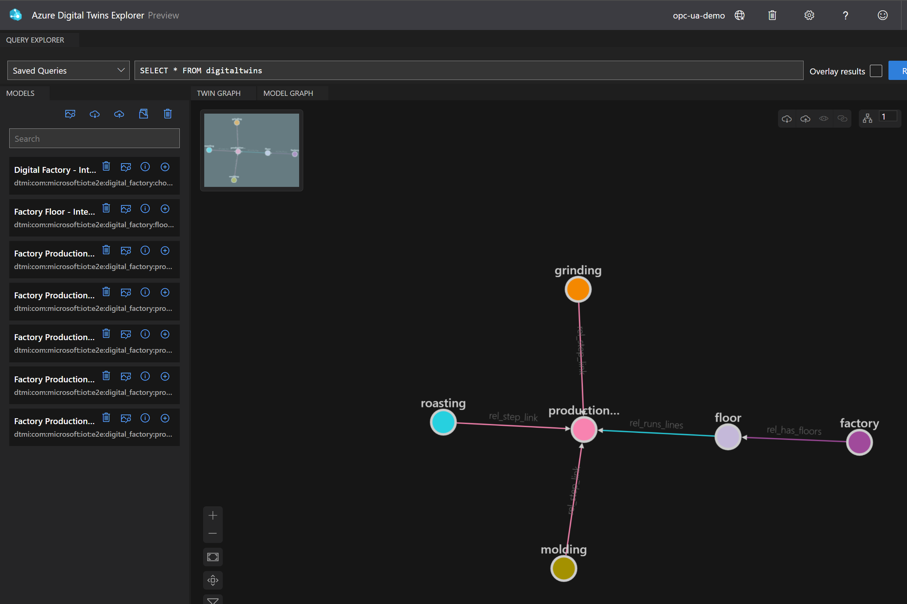
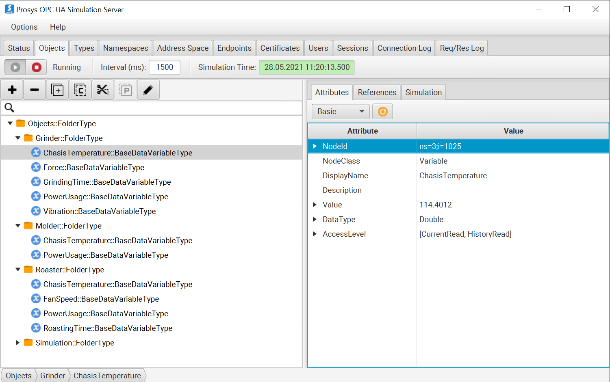

# Chocolate Factory Example

The chocolate factory example uses the example from the "[Build an Azure Digital Twins graph for a chocolate factory production line](https://docs.microsoft.com/en-us/learn/modules/build-azure-digital-twins-graph-for-chocolate-factory)" learning path.

The only difference between this sample and the simulation sample is the models, twins and mapping files. The process of connecting your OPC UA Server to Azure Digital Twins is the same.

### Step 1: Import Models and Create Twins
Get the models from the [GitHub Repo](https://github.com/Azure-Samples/digital-twins-samples/tree/master/HandsOnLab) and save them into your Azure Digital Twins insance. Then create your twin graph to look like this:



### Step 2: OPC UA Simulation Server
Create specific nodes on your OPC UA Simulation server to emmit telemetry that alignes with your digital twins. Here is a suggested configuration...



### Step 3: Configure publishednodes.json

Get the values for each OPC UA node and include them into the `publishednodes.json` file on your gateway device. The NodeId values on your server will differ than the example below.

Example:

```JSON
[
    {
        "EndpointUrl": "opc.tcp://20.185.195.172:53530/OPCUA/SimulationServer",
        "UseSecurity": false,
        "OpcNodes": [
            {
                "Id": "ns=3;i=1025",
                "OpcSamplingInterval": 2000,
                "OpcPublishingInterval": 5000
            },
            {
                "Id": "ns=3;i=1026",
                "OpcSamplingInterval": 2000,
                "OpcPublishingInterval": 5000
            },
            ...
        ]
    }
]
```

### Step 4: Update JSON in opcua-mapping.json

Edit the `opcua-mapping.json` file to map to the correct `NodeId` from your OPC UA server. 

Example
```JSON
[
    {
        "NodeId": "1025",
        "TwinId": "grinding",
        "Property": "ChasisTemperature",
        "ModelId": "dtmi:com:microsoft:iot:e2e:digital_factory:production_step_grinding;1"
    },
    {
        "NodeId": "1026",
        "TwinId": "grinding",
        "Property": "Force",
        "ModelId": "dtmi:com:microsoft:iot:e2e:digital_factory:production_step_grinding;1"
    },
    ...
]